# Data Flow Diagrams

This document describes the key data flows within PMOVES-DoX, including document ingestion, search, agent coordination, and knowledge retrieval.

## Overview

PMOVES-DoX processes multiple types of input through various pipelines:

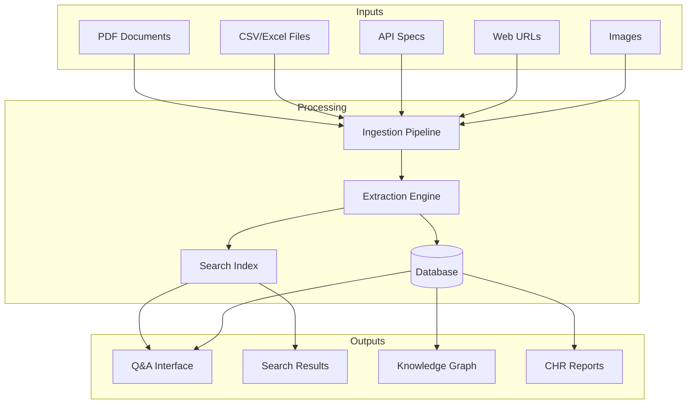

## Document Ingestion Flow

### End-to-End Document Processing

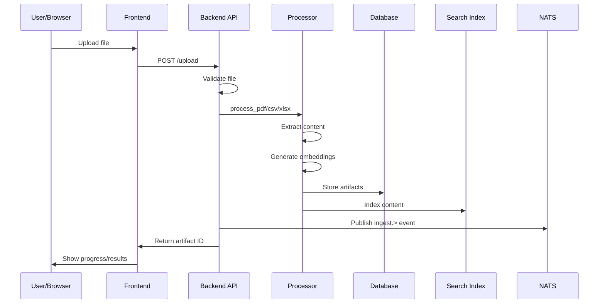

### PDF Processing Pipeline

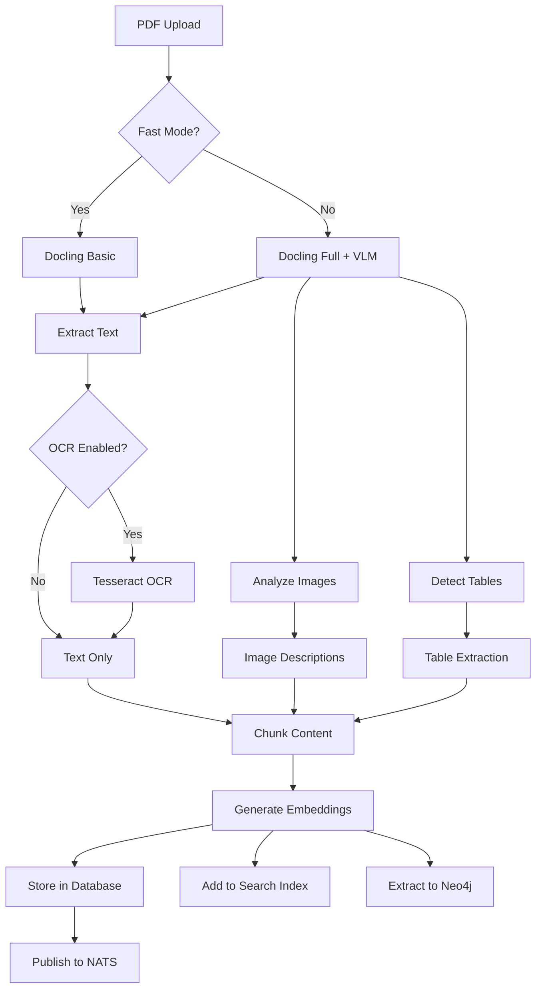

### Supported File Types

| File Type | Processor | Output Format |
|-----------|-----------|---------------|
| PDF | `pdf_processor.py` | Markdown + JSON metadata |
| CSV | `csv_processor.py` | Structured data + facts |
| XLSX/XLS | `xlsx_processor.py` | Structured data + facts |
| XML | `xml_ingestion.py` | Structured records |
| OpenAPI | `openapi_ingestion.py` | API catalog entries |
| Postman | `postman_ingestion.py` | API catalog entries |
| Web URL | `web_ingestion.py` | Markdown + assets |
| Images | `image_ocr.py` | Extracted text |
| Audio/Video | `media_transcriber.py` | Transcript + metadata |

## Search and Q&A Flow

### Semantic Search Flow

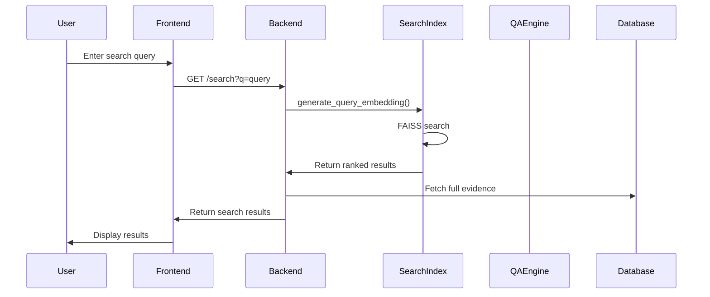

### Q&A with Citations

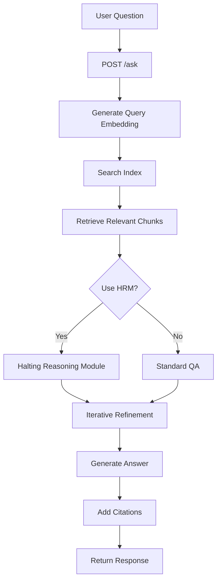

### LLM Integration Flow

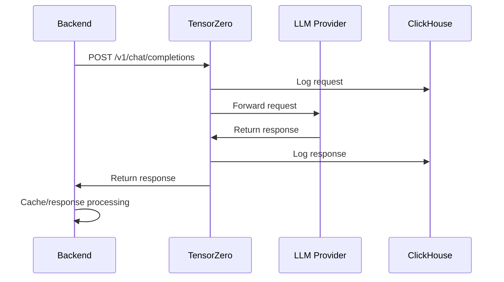

## Agent Coordination Flow

### Agent Zero Task Execution

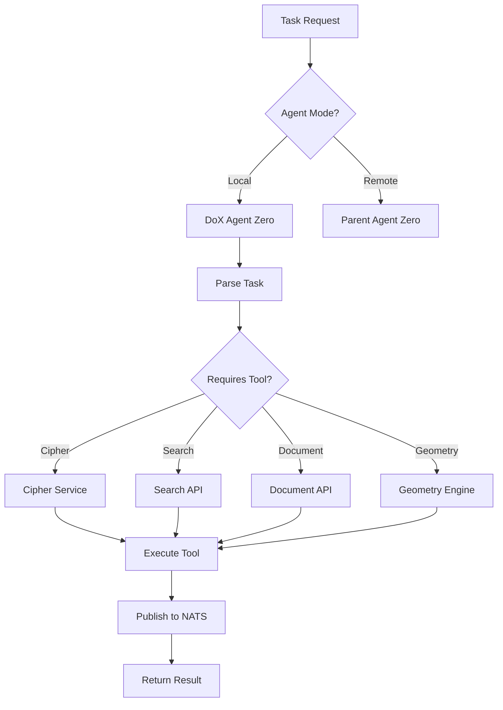

### NATS Message Flow

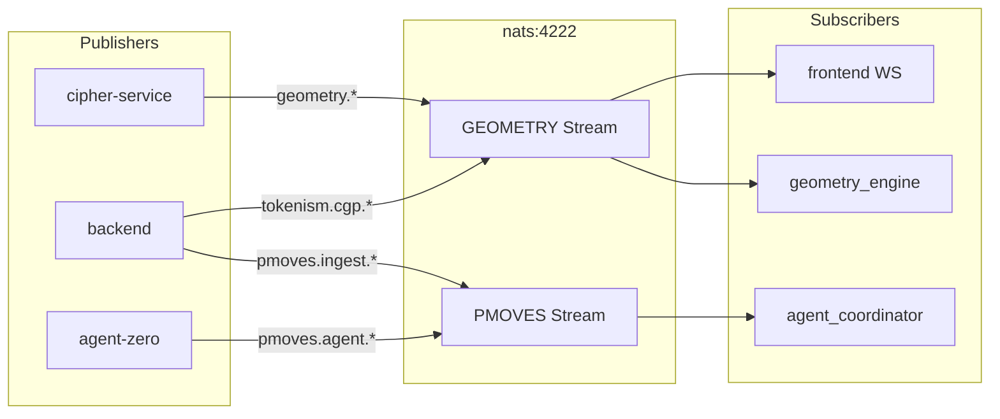

### CHIT Geometry Packet Flow

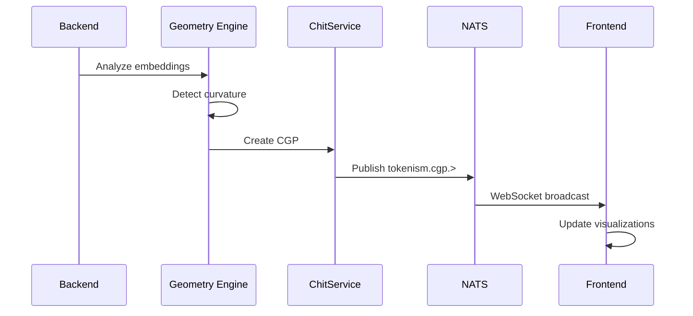

## Knowledge Graph Flow

### Neo4j Knowledge Extraction

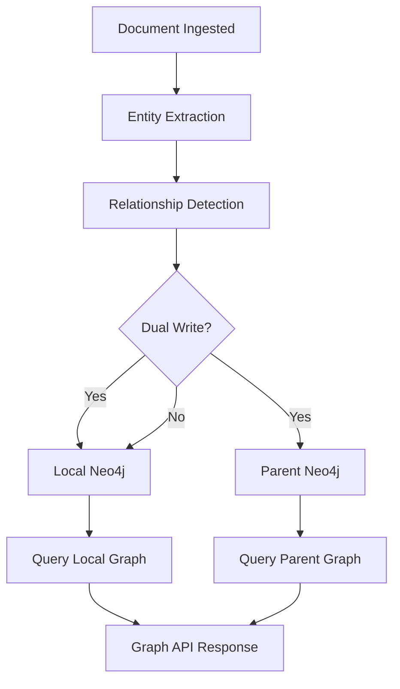

### Graph Query Flow

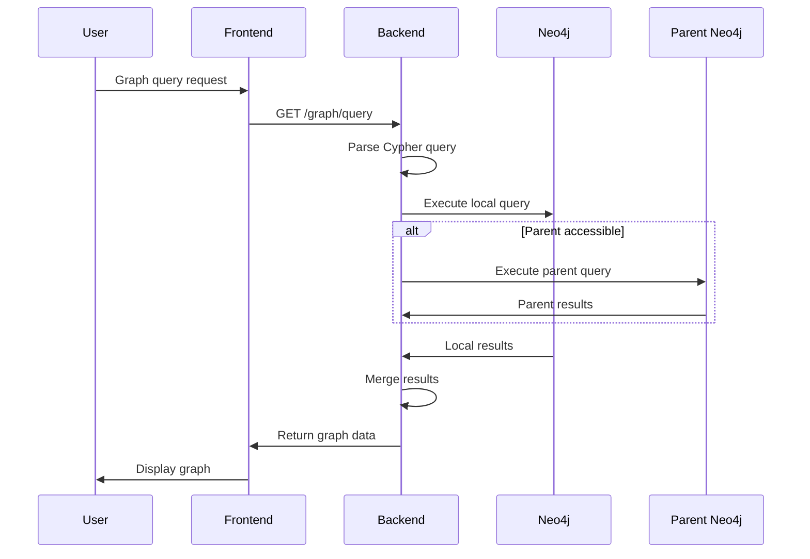

## CHR Pipeline Flow

### Constellation Harvest Regularization

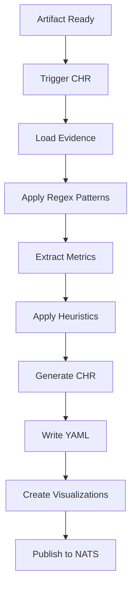

### CHR Output Flow

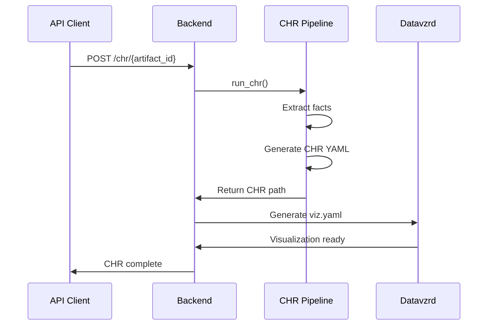

## Export Flows

### POML Export

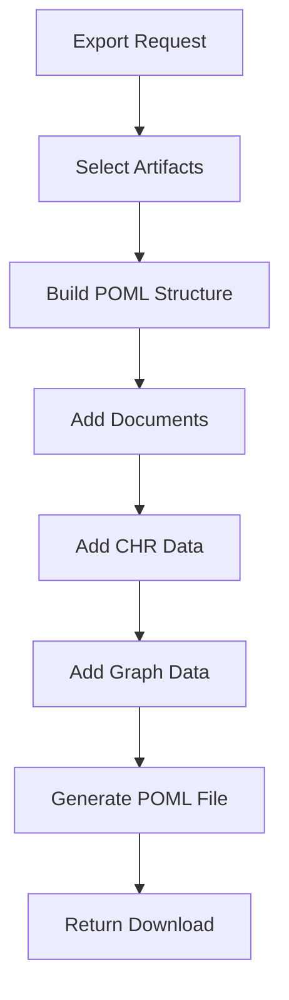

### A2UI Protocol Flow

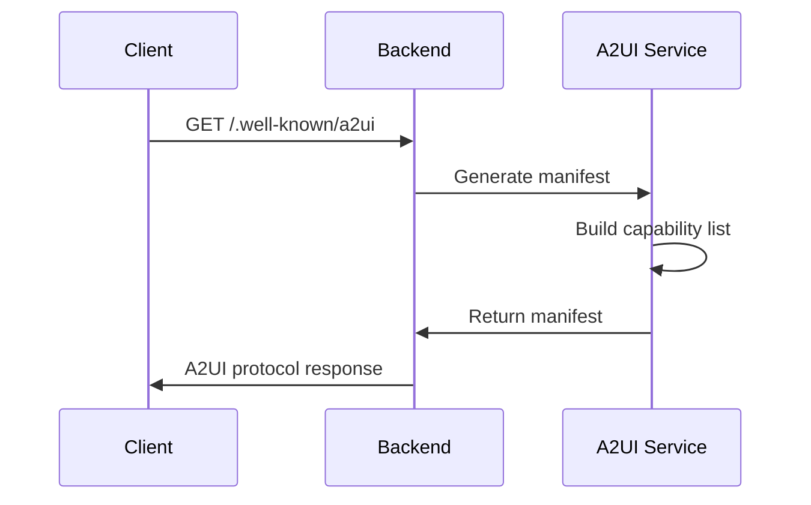

## Real-time Update Flow

### WebSocket Updates

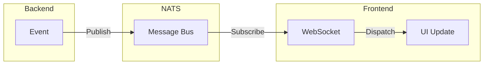

### Watch Folder Processing

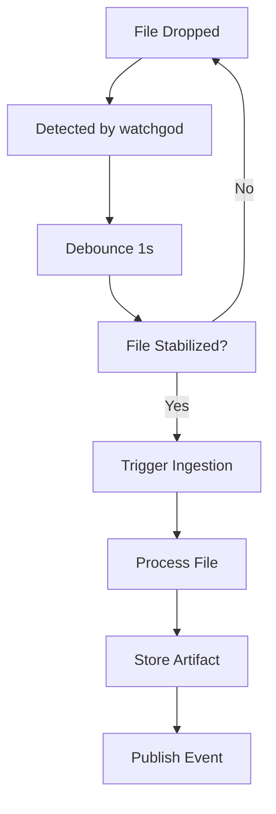

## API Request Flow

### Authentication Flow

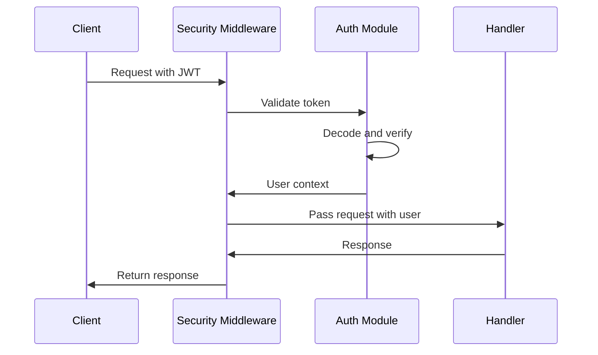

### Rate Limiting Flow

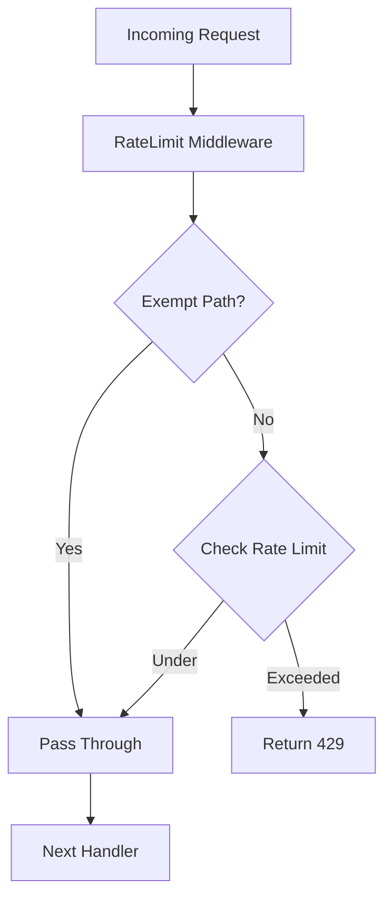

## Data Storage Flow

### Database Write Path

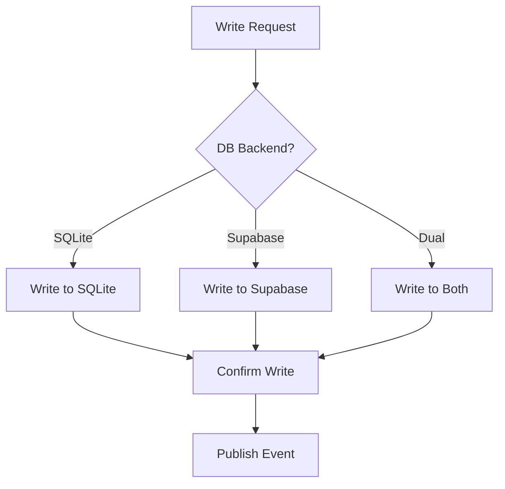

### Search Index Updates

```mermaid
sequenceDiagram
    participant API as API Handler
    participant DB as Database
    participant SI as SearchIndex
    participant FAISS as FAISS/NumPy

    API->>DB: Create evidence
    DB->>API: Return evidence ID
    API->>SI: Add to index
    SI->>FAISS: Generate embedding
    FAISS->>FAISS: Add to index
    FAISS->>SI: Index updated
    SI->>API: Confirm
```

## Monitoring Flow

### Metrics Collection

```mermaid
graph LR
    subgraph Services
        S1[backend]
        S2[agent-zero]
        S3[cipher-service]
    end

    subgraph Metrics
        M1[/metrics endpoint]
    end

    subgraph Prometheus
        P[Scrape & Store]
    end

    subgraph Grafana
        G[Dashboards]
    end

    S1 --> M1
    S2 --> M1
    S3 --> M1
    M1 --> P
    P --> G
```

### Logging Flow

```mermaid
graph LR
    subgraph Services
        S[All Services]
    end

    subgraph Loki
        L[Log Aggregation]
    end

    subgraph Grafana
        G[Log Explorer]
    end

    S -->|stdout/stderr| L
    L --> G
```

## Error Handling Flow

### Retry Logic

```mermaid
graph TD
    A[Request Fails] --> B{Retryable?}
    B -->|No| C[Return Error]
    B -->|Yes| D{Retries < Max?}
    D -->|No| C
    D -->|Yes| E[Wait Backoff]
    E --> F[Retry Request]
    F --> G{Success?}
    G -->|Yes| H[Return Result]
    G -->|No| B
```

### Circuit Breaker Pattern

```mermaid
stateDiagram-v2
    [*] --> Closed
    Closed --> Open: Failure Threshold
    Open --> HalfOpen: Timeout
    HalfOpen --> Closed: Success
    HalfOpen --> Open: Failure
    Closed --> [*]: Normal
    Open --> [*]: Circuit Open
```
