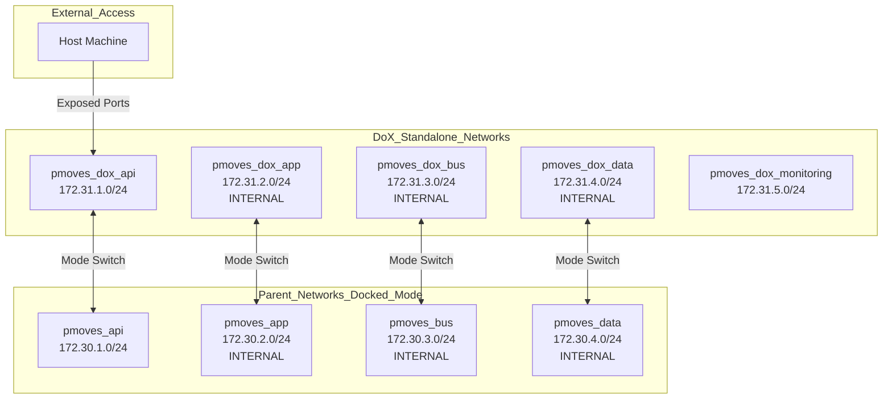
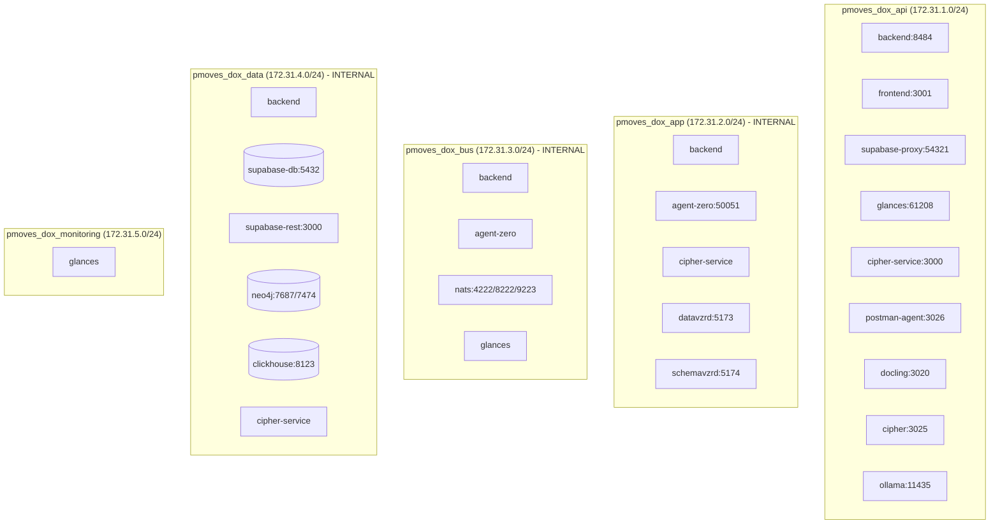
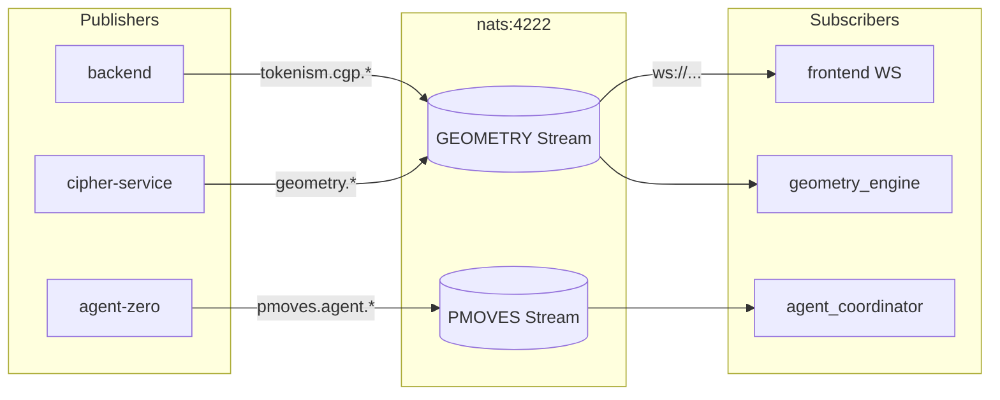
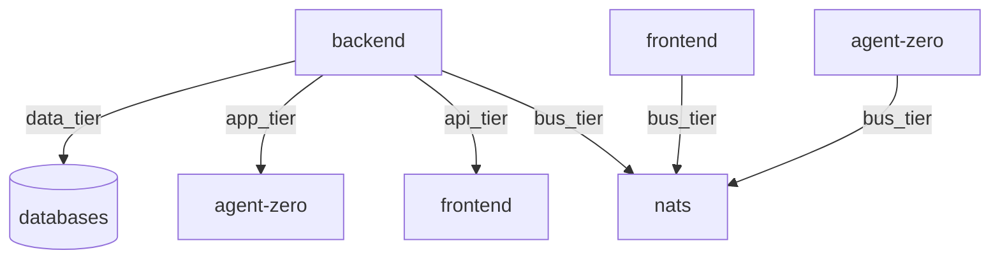
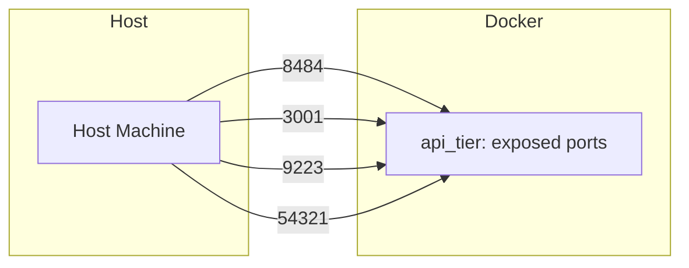

# Network Map

This document describes all Docker networks, their configurations, and how services communicate within PMOVES-DoX.

## Overview

PMOVES-DoX uses a tiered network architecture with two operational modes:

1. **Standalone Mode**: Isolated networks with namespaced prefixes (`pmoves_dox_*`)
2. **Docked Mode**: Connected to parent PMOVES.AI networks (`pmoves_*`)

## Network Architecture Diagram



## Network Definitions

### Standalone Mode Networks

| Network Name | CIDR Block | Internal | Purpose |
|--------------|------------|----------|---------|
| `pmoves_dox_api` | 172.31.1.0/24 | No | External API access, frontend proxy |
| `pmoves_dox_app` | 172.31.2.0/24 | Yes | Internal service communication |
| `pmoves_dox_bus` | 172.31.3.0/24 | Yes | NATS message bus traffic |
| `pmoves_dox_data` | 172.31.4.0/24 | Yes | Database and storage access |
| `pmoves_dox_monitoring` | 172.31.5.0/24 | No | Monitoring and metrics |

### Docked Mode Networks (Parent)

| Network Name | CIDR Block | Internal | Purpose |
|--------------|------------|----------|---------|
| `pmoves_api` | 172.30.1.0/24 | No | Parent API tier, shared across all services |
| `pmoves_app` | 172.30.2.0/24 | Yes | Parent app tier, internal services |
| `pmoves_bus` | 172.30.3.0/24 | Yes | Parent NATS message bus |
| `pmoves_data` | 172.30.4.0/24 | Yes | Parent data storage layer |

## Service Network Membership

### Services by Network (Standalone Mode)



### Services by Network (Docked Mode)

In docked mode, services connect to parent networks:

| Service | Parent Networks |
|---------|----------------|
| backend | pmoves_api, pmoves_app, pmoves_bus, pmoves_data |
| frontend | pmoves_api, pmoves_app |
| agent-zero | pmoves_api, pmoves_app, pmoves_bus, pmoves_data |
| cipher-service | pmoves_app |
| cipher | pmoves_app, pmoves_api |
| docling | pmoves_app, pmoves_api |
| postman-agent | pmoves_app, pmoves_api |
| neo4j | pmoves_data |
| glances | pmoves_api, pmoves_app, pmoves_bus |
| clickhouse | pmoves_data, pmoves_app |
| datavzrd | pmoves_app |
| schemavzrd | pmoves_app |

## Port Mappings

### Exposed Ports (Host → Container)

| Port | Service | Protocol | Network | Purpose |
|------|---------|----------|---------|---------|
| **8484** | backend | HTTP | api_tier | Main API endpoint |
| **3001** | frontend | HTTP | api_tier | Web UI |
| **4223** | nats | TCP | bus_tier | NATS client connections |
| **8223** | nats | HTTP | bus_tier | NATS monitoring |
| **9223** | nats | WebSocket | bus_tier | NATS WebSocket (standalone) |
| **54321** | supabase-proxy | HTTP | api_tier | Supabase API gateway |
| **50051** | agent-zero | HTTP | app_tier | Agent Zero API/Web UI |
| **3025** | cipher | HTTP | app_tier | Cipher MCP endpoint |
| **3020** | docling | HTTP | app_tier | Docling MCP endpoint |
| **3026** | postman-agent | HTTP | app_tier | Postman MCP endpoint |
| **17474** | neo4j | HTTP | data_tier | Neo4j browser |
| **17687** | neo4j | Bolt | data_tier | Neo4j protocol |
| **8123** | clickhouse | HTTP | data_tier | ClickHouse HTTP |
| **9000** | clickhouse | Native | data_tier | ClickHouse native |
| **3030** | tensorzero | HTTP | app_tier | TensorZero gateway |
| **11435** | ollama | HTTP | app_tier | Ollama API |
| **61208** | glances | HTTP | monitoring | System monitoring |
| **5173** | datavzrd | HTTP | app_tier | Data visualization |
| **5174** | schemavzrd | HTTP | app_tier | Schema visualization |

### Internal Ports (Container-to-Container)

| Port | Service | Accessible By |
|------|---------|---------------|
| **5432** | supabase-db | All data_tier services |
| **3000** | supabase-rest | supabase-proxy |
| **7687** | neo4j | backend (bolt protocol) |
| **7474** | neo4j | backend (HTTP) |
| **11434** | ollama | app_tier services |
| **3000** | tensorzero | backend, agent-zero |

## NATS Subject Flows

### NATS Subjects

```
# Geometry Bus (CHIT Protocol)
tokenism.cgp.>           # CHIT Geometry Packets
geometry.>               # Geometry events
geometry.curvature.>     # Curvature detection events
geometry.manifold.>      # Manifold configuration events

# Service Events
pmoves.ingest.>          # Document ingestion events
pmoves.analysis.>        # Analysis completion events
pmoves.agent.>           # Agent coordination events
pmoves.health.>          # Health check events
```

### NATS JetStream Streams



### WebSocket Connections

| Mode | WebSocket URL | Purpose |
|------|---------------|---------|
| Standalone | `ws://localhost:9223` | DoX-local NATS WebSocket |
| Docked | `ws://localhost:9222` | Parent PMOVES.AI NATS WebSocket |

## Network Isolation

### Internal Networks

The following networks are marked `internal: true`, meaning:
- No internet access from containers on these networks
- No port mappings to host
- Services can communicate with each other but not external

| Network | Services | Reason for Isolation |
|---------|----------|---------------------|
| `pmoves_dox_app` | backend, agent-zero, cipher-service | Protect internal service communication |
| `pmoves_dox_bus` | NATS, backend, agent-zero | Secure message bus traffic |
| `pmoves_dox_data` | All databases | Protect data storage layer |

### Cross-Network Communication

Services that need to communicate across networks:



## Service Discovery

### DNS Resolution

Services can reach each other using container names as DNS hostnames:

```bash
# From backend container
curl http://supabase-db:5432              # Database
curl http://nats:4222                     # NATS
curl http://neo4j:7687                   # Neo4j
curl http://tensorzero-gateway:3030      # TensorZero
curl http://agent-zero:50051             # Agent Zero
curl http://ollama:11434                 # Ollama
```

### Network Aliases

Some services have network aliases for easier discovery:

| Service | Aliases | Networks |
|---------|---------|----------|
| tensorzero | tensorzero-gateway | app_tier, api_tier, data_tier |

## Docker Compose Network Configuration

### Standalone Configuration

```yaml
networks:
  api_tier:
    driver: bridge
    name: pmoves_dox_api
    ipam:
      config:
        - subnet: 172.31.1.0/24

  app_tier:
    driver: bridge
    name: pmoves_dox_app
    internal: true
    ipam:
      config:
        - subnet: 172.31.2.0/24

  bus_tier:
    driver: bridge
    name: pmoves_dox_bus
    internal: true
    ipam:
      config:
        - subnet: 172.31.3.0/24

  data_tier:
    driver: bridge
    name: pmoves_dox_data
    internal: true
    ipam:
      config:
        - subnet: 172.31.4.0/24
```

### Docked Configuration

```yaml
networks:
  api_tier:
    external: true
    name: pmoves_api

  app_tier:
    external: true
    name: pmoves_app

  bus_tier:
    external: true
    name: pmoves_bus

  data_tier:
    external: true
    name: pmoves_data
```

## Firewall Considerations

### Required Ports for Host Access



If using a firewall (ufw, firewalld, etc.), ensure these ports are open:
- TCP 8484 (backend API)
- TCP 3001 (frontend)
- TCP 4223, 8223, 9223 (NATS)
- TCP 54321 (Supabase proxy)
- TCP 50051 (Agent Zero UI)
- TCP 17474, 17687 (Neo4j)
- TCP 61208 (Glances)

## Troubleshooting Network Issues

### Check Network Connectivity

```bash
# List all networks
docker network ls | grep pmoves

# Inspect a network
docker network inspect pmoves_dox_api

# Check which containers are on a network
docker network inspect pmoves_dox_api -f '{{range .Containers}}{{.Name}} {{end}}'

# Test connectivity between containers
docker compose exec backend ping -c 1 nats
docker compose exec backend ping -c 1 supabase-db
```

### Common Network Issues

| Issue | Cause | Solution |
|-------|-------|----------|
| Service can't reach database | Not on same network | Add service to data_tier network |
| WebSocket connection failed | Wrong port for mode | Use 9223 (standalone) or 9222 (docked) |
| Port already in use | Conflicting port | Change host port mapping |
| Can't resolve service name | Network isolation | Ensure both services share a network |

### Network Mode Switching

To switch between standalone and docked modes:

```bash
# From standalone to docked
docker compose down
docker compose -f docker-compose.yml -f docker-compose.docked.yml up -d

# From docked to standalone
docker compose -f docker-compose.yml -f docker-compose.docked.yml down
docker compose up -d
```

## External Service URLs

### Service URLs by Mode

| Service | Standalone URL | Docked URL |
|---------|----------------|------------|
| Backend API | `http://localhost:8484` | `http://localhost:8484` |
| Frontend | `http://localhost:3001` | `http://localhost:3001` |
| Supabase API | `http://localhost:54321` | Parent URL |
| Agent Zero UI | `http://localhost:50051` | `http://localhost:50051` |
| Neo4j Browser | `http://localhost:17474` | `http://localhost:17474` |
| Glances | `http://localhost:61208` | `http://localhost:61208` |
| NATS Monitor | `http://localhost:8223` | Parent URL |
| TensorZero UI | (via backend) | Parent URL |
