# Repository Map

This document explains the PMOVES-DoX folder structure, submodule catalog, and key file purposes.

## Repository Structure Overview

```mermaid
graph TD
    ROOT[PMOVES-DoX/] --> CFG[Configuration]
    ROOT --> DOC[Documentation]
    ROOT --> BCK[Backend]
    ROOT --> FRT[Frontend]
    ROOT --> EXT[External Submodules]
    ROOT --> TLS[Tools]
    ROOT --> SCR[Scripts]
    ROOT --> TST[Tests]

    CFG --> CFG1[docker-compose*.yml]
    CFG --> CFG2[env.shared]
    CFG --> CFG3[tensorzero.toml]

    DOC --> DOC1[docs/]
    DOC --> DOC2[README.md]

    BCK --> BCK1[backend/app/]
    BCK --> BCK2[backend/tests/]
    BCK --> BCK3[backend/migrations/]

    FRT --> FRT1[frontend/app/]
    FRT --> FRT2[frontend/components/]

    EXT --> EXT1[external/PMOVES-*]
    EXT --> EXT2[external/Pmoves-*]
    EXT --> EXT3[A2UI_reference/]
    EXT --> EXT4[PsyFeR_reference/]

    TLS --> TLS1[tools/datavzrd/]
    TLS --> TLS2[tools/schemavzrd/]
    TLS --> TLS3[tools/pmoves_cli/]
```



## Top-Level Directory Structure

```
PMOVES-DoX/
├── backend/                    # FastAPI Python backend
├── frontend/                   # Next.js TypeScript frontend
├── external/                   # Git submodules
├── tools/                      # Utility tools and CLI
├── scripts/                    # Setup and utility scripts
├── tests/                      # Integration and smoke tests
├── docs/                       # Documentation
├── config/                     # Configuration files
├── nginx/                      # Nginx proxy configs
├── pmoves_announcer/           # Service announcer
├── pmoves_health/              # Health check utilities
├── pmoves_registry/            # Service registry
├── smoke/                      # Smoke test scripts
├── A2UI_reference/             # A2UI protocol submodule
├── PsyFeR_reference/           # PsyFeR memory submodule
└── docker-compose*.yml         # Docker Compose configurations
```

## Backend Structure

```
backend/
├── app/                        # Main application code
│   ├── main.py                 # FastAPI app entry point
│   ├── config.py               # Configuration management
│   ├── globals.py              # Global state
│   ├── database.py             # SQLite database implementation
│   ├── database_supabase.py    # Supabase database implementation
│   ├── database_neo4j.py       # Neo4j graph database
│   ├── database_factory.py     # Database backend factory
│   ├── search.py               # Search index (FAISS/NumPy)
│   ├── qa_engine.py            # Question answering engine
│   ├── hrm.py                  # Halting Reasoning Module
│   ├── chr_pipeline.py         # CHR generation
│   ├── export_poml.py          # POML export
│   │
│   ├── api/                    # API layer
│   │   └── routers/
│   │       ├── documents.py    # Document endpoints
│   │       ├── analysis.py     # Analysis endpoints
│   │       ├── system.py       # System endpoints
│   │       ├── cipher.py       # Cipher/memory endpoints
│   │       ├── models.py       # Model management
│   │       ├── graph.py        # Knowledge graph
│   │       ├── a2a.py          # A2UI protocol
│   │       └── orchestration.py # Agent orchestration
│   │
│   ├── ingestion/              # Document processors
│   │   ├── pdf_processor.py        # PDF with Docling
│   │   ├── csv_processor.py        # CSV processing
│   │   ├── xlsx_processor.py       # Excel processing
│   │   ├── xml_ingestion.py        # XML log parsing
│   │   ├── openapi_ingestion.py    # OpenAPI specs
│   │   ├── postman_ingestion.py    # Postman collections
│   │   ├── web_ingestion.py        # Web scraping
│   │   ├── media_transcriber.py    # Audio/video
│   │   ├── image_ocr.py            # Image OCR
│   │   ├── advanced_table_processor.py  # Complex tables
│   │   ├── complex_table_processor.py   # Nested tables
│   │   ├── chart_processor.py      # Chart detection
│   │   ├── formula_processor.py    # Math formulas
│   │   └── __init__.py
│   │
│   ├── analysis/               # Analysis modules
│   │   ├── summarization.py        # Document summarization
│   │   ├── financial_statement_detector.py
│   │   ├── structure_processor.py
│   │   ├── ner_processor.py
│   │   └── metric_extractor.py
│   │
│   ├── extraction/             # Data extraction
│   │   └── langextract_adapter.py  # Tag extraction
│   │
│   ├── services/               # Business logic services
│   │   ├── agent_dispatcher.py     # Agent routing
│   │   ├── thread_manager.py       # Thread management
│   │   ├── cipher_service.py       # Memory/skills
│   │   ├── chit_service.py         # CHIT protocol
│   │   ├── geometry_engine.py      # Curvature analysis
│   │   ├── geometric_reasoning.py  # Geometric inference
│   │   ├── reasoning_service.py    # Reasoning engine
│   │   └── a2ui_service.py         # A2UI protocol
│   │
│   ├── models/                 # Pydantic models
│   │   ├── agent_card.py
│   │   └── __init__.py
│   │
│   ├── middleware/             # Middleware
│   │   ├── rate_limit.py
│   │   ├── security_headers.py
│   │   └── __init__.py
│   │
│   ├── security/               # Security utilities
│   │   ├── middleware.py
│   │   ├── validators.py
│   │   ├── patterns.py
│   │   └── __init__.py
│   │
│   └── auth/                   # Authentication
│       └── __init__.py
│
├── migrations/                 # Alembic database migrations
│   ├── versions/               # Migration scripts
│   └── alembic.ini             # Alembic config
│
├── tests/                      # Backend unit tests
│
├── artifacts/                  # Processed document outputs
├── uploads/                    # Uploaded file storage
├── data/                       # Runtime data
├── cipher-config/              # Cipher configuration
├── nats-config/                # NATS configuration
├── mcp/                        # MCP manifest
│
├── Dockerfile                  # CPU container image
├── Dockerfile.gpu              # GPU container image
├── Dockerfile.jetson           # Jetson Nano image
├── Dockerfile.jetson.orin      # Jetson Orin image
├── requirements.txt            # Python dependencies
├── pyproject.toml              # Project metadata
├── uv.lock                     # UV lock file
├── skills_catalog.yaml         # Skills registry
└── .env.example                # Environment template
```

## Frontend Structure

```
frontend/
├── app/                        # Next.js app directory
│   ├── layout.tsx              # Root layout
│   ├── page.tsx                # Main dashboard
│   ├── globals.css             # Global styles
│   │
│   ├── a2ui/                   # A2UI pages
│   ├── apis/                   # API catalog pages
│   ├── artifacts/              # Document management pages
│   ├── cookbooks/              # Cookbook pages
│   ├── geometry/               # Geometric visualization pages
│   ├── logs/                   # Log viewing pages
│   ├── modellab/               # Model lab pages
│   └── tags/                   # Tag management pages
│
├── components/                 # React components
│   ├── geometry/               # Geometric visualizations
│   │   ├── HyperbolicNavigator.tsx
│   │   ├── Manifold3D.tsx
│   │   └── ZetaVisualizer.tsx
│   │
│   ├── ui/                     # UI primitives
│   │   ├── button.tsx
│   │   ├── card.tsx
│   │   └── ...
│   │
│   ├── a2ui/                   # A2UI components
│   ├── APIsPanel.tsx           # API catalog
│   ├── ArtifactsPanel.tsx      # Document list
│   ├── CHRPanel.tsx            # CHR viewer
│   ├── CookbookCard.tsx        # Cookbook card
│   ├── EntitiesPanel.tsx       # Entity viewer
│   ├── FactsViewer.tsx         # Fact display
│   ├── FileUpload.tsx          # File upload
│   ├── GlobalSearch.tsx        # Search interface
│   ├── KnowledgeGraphViewer.tsx # Graph viz
│   ├── LogsPanel.tsx           # Log viewer
│   ├── MediaArtifactsPanel.tsx # Media artifacts
│   ├── MemoryViewer.tsx        # Memory view
│   ├── MetricHitsPanel.tsx     # Metrics display
│   ├── QAInterface.tsx         # Q&A chat
│   ├── ReasoningTracer.tsx     # Reasoning trace
│   ├── SettingsModal.tsx       # Settings
│   ├── Sidebar.tsx             # Navigation
│   ├── SkillsRegistry.tsx      # Skills list
│   ├── StructurePanel.tsx      # Document structure
│   ├── SummariesPanel.tsx      # Summaries
│   ├── TagsPanel.tsx           # Tags
│   ├── Toast.tsx               # Notifications
│   └── ErrorBoundary.tsx       # Error handling
│
├── lib/                        # Utility libraries
│   ├── nats-context.tsx        # NATS WebSocket context
│   └── serviceDiscovery.ts     # Service discovery
│
├── Dockerfile                  # Container image
├── package.json                # Dependencies
├── tsconfig.json               # TypeScript config
├── next.config.js              # Next.js config
├── tailwind.config.js          # Tailwind config
└── postcss.config.js           # PostCSS config
```

## External Submodules

```
external/
├── PMOVES-Agent-Zero/          # Agent orchestrator
│   └── branch: PMOVES.AI-Edition-Hardened-DoX
│
├── PMOVES-BoTZ/                # BotZ framework
│   └── branch: PMOVES.AI-Edition-Hardened
│
├── PMOVES-BotZ-gateway/        # MCP gateway framework
│   └── branch: PMOVES.AI-Edition-Hardened
│
├── PMOVES-docling/             # Docling document processing
│   └── branch: PMOVES.AI-Edition-Hardened-DoX
│
├── PMOVES-google_workspace_mcp/ # Google Workspace MCP
│   └── branch: PMOVES.AI-Edition-Hardened-DoX
│
├── PMOVES-n8n/                 # n8n workflow automation
│   └── branch: PMOVES.AI-Edition-Hardened-DoX
│
├── PMOVES-n8n-mcp/             # n8n MCP integration
│   └── branch: PMOVES.AI-Edition-Hardened-DoX
│
├── PMOVES-postman-mcp-server/  # Postman MCP server
│   └── branch: PMOVES.AI-Edition-Hardened-DoX
│
├── PMOVES-bentopdf/            # PDF processing utilities
│   └── branch: PMOVES.AI-Edition-Hardened-DoX
│
├── PMOVES-supabase/            # Supabase fork
│   └── branch: (supabase main)
│
├── Pmoves-Glancer/             # System monitoring
│   └── branch: PMOVES.AI-Edition-Hardened-DoX
│
├── Pmoves-hyperdimensions/     # Mathematical visualization
│   └── branch: PMOVES.AI-Edition-Hardened-DoX
│
└── conductor/                  # Google Conductor CLI
    └── branch: (upstream main)
```

## Reference Submodules

```
A2UI_reference/                # A2UI protocol reference
└── branch: PMOVES.AI-Edition-Hardened-DoX

PsyFeR_reference/               # PsyFeR memory framework
└── branch: PMOVES.AI-Edition-Hardened-DoX
```

## Tools Directory

```
tools/
├── datavzrd/                   # Data visualization tool
│   ├── Dockerfile
│   └── ...
│
├── schemavzrd/                 # Schema visualization tool
│   ├── Dockerfile
│   └── ...
│
├── pmoves_cli/                 # DoX CLI tool
│   ├── __init__.py
│   └── cli.py
│
├── backfill_supabase.py        # Supabase backfill script
├── gen_jwt.py                  # JWT generation
├── ingest_blueprints.py        # Blueprint ingestion
├── run-smoke.js                # Smoke test runner
├── run-ui-smoke.js             # UI smoke test runner
├── simulate_geometry.py        # Geometry simulation
├── test_demo_flow.py           # Demo flow testing
└── verify_integrations.py      # Integration verification
```

## Configuration Files

### Docker Compose Files

| File | Purpose |
|------|---------|
| `docker-compose.yml` | Main configuration (GPU default) |
| `docker-compose.cpu.yml` | CPU-only profile |
| `docker-compose.gpu.yml` | GPU-enabled profile |
| `docker-compose.docked.yml` | Docked mode (parent integration) |
| `docker-compose.supabase.yml` | Supabase integration |
| `docker-compose.n8n.yml` | n8n workflow integration |
| `docker-compose.ollama-gpu.yml` | Ollama with GPU |
| `docker-compose.jetson.yml` | Jetson Nano configuration |
| `docker-compose.jetson-orin.yml` | Jetson Orin configuration |
| `docker-compose.override.yml.example` | Override template |
| `docker-compose.pmoves.yml` | PMOVES environment anchors |

### Environment Files

| File | Purpose |
|------|---------|
| `env.shared` | Base environment (all tiers) |
| `env.tier-api` | API tier environment |
| `env.tier-agent` | Agent tier environment |
| `env.tier-media` | Media tier environment |
| `.env.local` | Local overrides |
| `.env.example` | Environment template |

### Configuration Files

| File | Purpose |
|------|---------|
| `tensorzero.toml` | TensorZero gateway configuration |
| `backend/.env.example` | Backend environment template |
| `frontend/.env.local.example` | Frontend environment template |
| `backend/nats-config/nats.conf` | NATS server configuration |
| `nginx/supabase-proxy.conf` | Nginx Supabase proxy |
| `backend/cipher-config/` | Cipher service config |
| `config/clickhouse-listen.xml` | ClickHouse network config |

## Key Files and Their Purposes

### Root Level

| File | Purpose |
|------|---------|
| `README.md` | Main documentation |
| `CLAUDE.md` | Claude Code CLI context |
| `.gitmodules` | Submodule registry |
| `Makefile` | Build automation |
| `setup.ps1` | Windows setup script |
| `pyproject.toml` | Python project metadata |
| `package.json` | Node.js metadata |
| `.pre-commit-config.yaml` | Pre-commit hooks |
| `.coderabbit.yaml` | CodeRabbit AI reviewer config |

### Backend Key Files

| File | Purpose |
|------|---------|
| `app/main.py` | FastAPI application, routes, middleware |
| `app/database.py` | SQLite database models and operations |
| `app/database_supabase.py` | Supabase database implementation |
| `app/database_factory.py` | Database backend selection |
| `app/search.py` | FAISS/NumPy vector search |
| `app/qa_engine.py` | Question answering logic |
| `app/chr_pipeline.py` | CHR generation |
| `app/hrm.py` | Halting Reasoning Module |
| `app/config.py` | Configuration management |
| `requirements.txt` | Python dependencies |
| `skills_catalog.yaml` | Agent skills registry |

### Frontend Key Files

| File | Purpose |
|------|---------|
| `app/layout.tsx` | Root layout with providers |
| `app/page.tsx` | Main dashboard page |
| `lib/nats-context.tsx` | NATS WebSocket context |
| `components/FileUpload.tsx` | File upload component |
| `components/QAInterface.tsx` | Q&A chat component |
| `components/geometry/` | Geometric visualizations |
| `package.json` | Dependencies and scripts |

## Documentation Structure

```
docs/
├── architecture/               # Architecture documentation (NEW)
│   ├── service-dependencies.md # Service dependency graph
│   ├── network-map.md          # Network topology
│   ├── data-flows.md           # Data flow diagrams
│   ├── service-catalog.md      # Complete service catalog
│   └── repository-map.md       # This file
│
├── context/                    # Context documentation
│   ├── tensorzero.md           # TensorZero guide
│   ├── services-catalog.md     # Services reference
│   ├── submodules.md           # Submodules catalog
│   └── nats-subjects.md        # NATS subjects
│
├── AGENT_GUIDE.md              # Agent usage guide
├── API_REFERENCE.md            # Complete API reference
├── ARCHITECTURE.md             # Technical architecture
├── COOKBOOKS.md                # Cookbook documentation
├── DEPLOYMENT.md               # Deployment guide
├── DOCKING_GUIDE.md            # Parent integration
├── DOCS_INDEX.md               # Documentation index
├── GEOMETRIC_INTELLIGENCE.md   # Geometric features
├── GEOMETRY_BUS_INTEGRATION.md # Geometry bus
├── PMOVESCHIT.md               # CHIT protocol
├── SUPABASE_PATTERNS.md        # Supabase patterns
├── USER_GUIDE.md               # User guide
└── ...                         # Additional docs
```

## Submodule Branch Strategy

All PMOVES submodules use the `PMOVES.AI-Edition-Hardened-DoX` branch for DoX integration:
- Ensures compatibility with DoX requirements
- Contains DoX-specific patches and configurations
- Synchronized with parent repository updates

## Initialization

### Initial Setup

```bash
# Clone repository
git clone https://github.com/POWERFULMOVES/PMOVES-DoX.git
cd PMOVES-DoX

# Initialize submodules
git submodule update --init --recursive

# Copy environment files
cp .env.example .env.local
cp backend/.env.example backend/.env
cp frontend/.env.local.example frontend/.env.local

# Build and start
docker compose up -d
```

### Submodule Management

```bash
# Update all submodules
git submodule update --remote --merge

# Update specific submodule
git submodule update --remote --merge external/PMOVES-Agent-Zero

# Check submodule status
git submodule status
```

## File Naming Conventions

| Pattern | Purpose |
|---------|---------|
| `*_processor.py` | Ingestion processors |
| `*_service.py` | Business logic services |
| `*_adapter.py` | External service adapters |
| `*Panel.tsx` | Frontend page panels |
| `docker-compose.*.yml` | Docker profiles |
| `env.*` | Environment configs |
| `*.toml` | Service configs |

## Build Artifacts

```
artifacts/                      # Processed outputs
├── <filename>/                 # Per-document artifacts
│   ├── <filename>.md          # Markdown extraction
│   ├── <filename>.json        # Structured data
│   ├── chr.yml                # CHR output
│   ├── poml.yml               # POML export
│   └── datavzrd/              # Visualization configs
```

## Data Persistence

```
data/                           # Runtime data (gitignored)
uploads/                        # Uploaded files (gitignored)
backend/data/                   # SQLite database (gitignored)
```

## Docker Volumes

| Volume | Purpose |
|--------|---------|
| `hf-cache` | HuggingFace model cache |
| `ollama_data` | Ollama models |
| `cipher-data` | Cipher memory |
| `supabase_data` | Supabase database |
| `neo4j-data` | Neo4j data |
| `neo4j-logs` | Neo4j logs |
| `agent-zero-data` | Agent Zero data |
| `clickhouse-data` | ClickHouse data |
