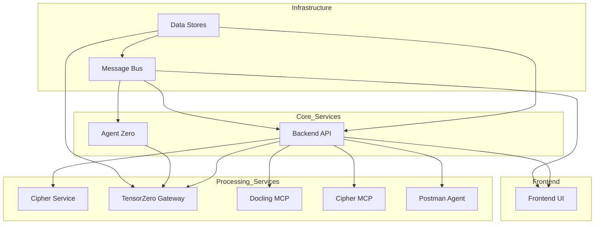
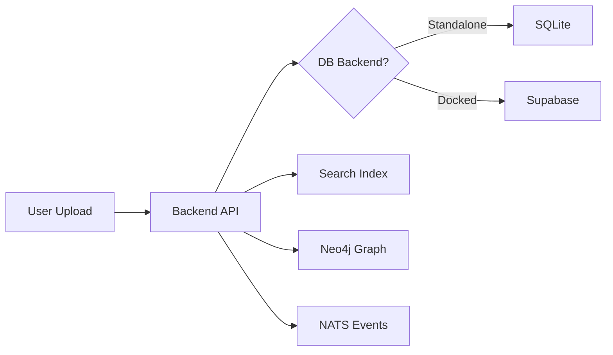
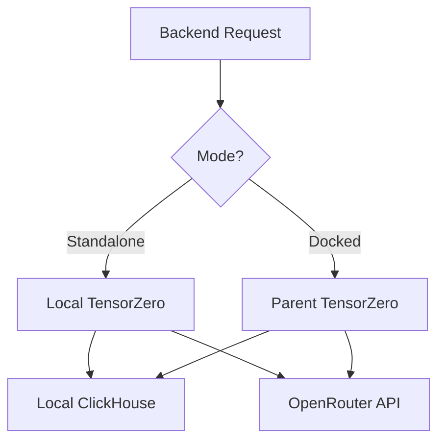
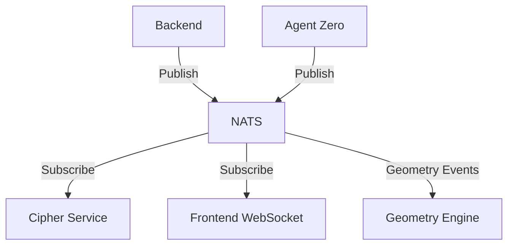

# Service Dependencies Graph

This document describes the dependency relationships between PMOVES-DoX services, including startup order and critical dependencies.

## Overview

PMOVES-DoX has two operational modes:
- **Standalone Mode**: All services run independently within DoX networks
- **Docked Mode**: DoX connects to parent PMOVES.AI infrastructure

## Startup Order

The following startup sequence ensures all dependencies are satisfied:



## Service Dependency Table

| Service | Depends On | Startup Priority | Critical Path |
|---------|-----------|------------------|---------------|
| **Infrastructure Tier** ||||
| supabase-db | None | 0 (must start first) | Yes |
| nats | None | 0 (can start parallel) | Yes |
| neo4j | None | 0 (can start parallel) | No |
| clickhouse | None | 0 (can start parallel) | No |
| **Core Services Tier** ||||
| backend | supabase-db, nats | 1 (after infra) | Yes |
| supabase-rest | supabase-db | 1 | Yes |
| supabase-proxy | supabase-rest | 2 | Yes |
| tensorzero | clickhouse | 1 | Yes |
| agent-zero | tensorzero | 2 | Yes |
| **Processing Services Tier** ||||
| cipher-service | nats, backend | 2 | No |
| cipher | nats | 2 | No |
| docling | backend | 2 | No |
| postman-agent | backend | 2 | No |
| ollama | None | 1 (if GPU available) | No |
| **Frontend Tier** ||||
| frontend | backend, nats | 3 (after core) | Yes |
| **Utilities Tier** ||||
| glances | None | 3 (any time) | No |
| datavzrd | backend | 4 (after backend) | No |
| schemavzrd | backend | 4 (after backend) | No |

## Critical Dependencies

### Data Path Dependencies



### LLM Dependency Chain



### NATS Message Flow



## Health Check Dependencies

Services must pass health checks before dependent services start:

| Service | Health Endpoint | Required By |
|---------|----------------|-------------|
| `supabase-db` | `pg_isready -U postgres` | backend, supabase-rest |
| `nats` | `nats-server --help` | backend, agent-zero, all MCP |
| `clickhouse` | `GET /ping` | tensorzero |
| `tensorzero` | `GET /health` | backend, agent-zero |
| `backend` | `GET /healthz` | frontend, all agents |
| `neo4j` | `GET /` | backend (optional) |
| `agent-zero` | `GET /health` | backend (optional) |

## Failure Scenarios

### Critical Failure Cascade

```
supabase-db DOWN
    ↓
supabase-rest DOWN
    ↓
supabase-proxy DOWN
    ↓
Backend: Falls back to SQLite (if configured)
```

### Non-Critical Degradation

```
neo4j DOWN
    ↓
Backend: Graph features disabled (continues operation)
```

```
ollama DOWN
    ↓
Backend: Falls back to cloud LLMs (OpenRouter, Gemini)
```

```
agent-zero DOWN
    ↓
Backend: Agent features disabled (continues operation)
```

## Startup Sequences by Mode

### Standalone Mode Startup

```bash
# Phase 0: Infrastructure (parallel)
docker compose up -d supabase-db nats neo4j clickhouse

# Wait for health checks
docker compose ps

# Phase 1: Core services (parallel)
docker compose up -d backend tensorzero

# Phase 2: Agents and processing
docker compose up -d agent-zero cipher-service cipher docling postman-agent

# Phase 3: Frontend
docker compose up -d frontend

# Phase 4: Utilities (optional)
docker compose --profile tools up -d glances datavzrd schemavzrd
```

### Docked Mode Startup

In docked mode, parent infrastructure provides:
- NATS (`nats://nats:4222`)
- TensorZero (`http://tensorzero-gateway:3030`)
- Supabase (`http://supabase-kong:8000`)
- ClickHouse (`http://tensorzero-clickhouse:8123`)

DoX-only startup sequence:
```bash
# Connect to parent networks
docker compose -f docker-compose.yml -f docker-compose.docked.yml up -d

# Services started:
# 1. backend (uses parent infra)
# 2. frontend (uses parent NATS)
# 3. agent-zero (uses parent TensorZero)
# 4. cipher-service (local)
# 5. docling, cipher, postman-agent (local)
# 6. neo4j (local, dual-write to parent)
# 7. glances, clickhouse, datavzrd (local)
```

## Network-Level Dependencies

### Standalone Networks

| Network | Purpose | Services |
|---------|---------|----------|
| `pmoves_dox_api` | External API access | backend, frontend, supabase-proxy |
| `pmoves_dox_app` | Internal app communication | backend, agent-zero, all agents, ollama |
| `pmoves_dox_bus` | NATS message bus | backend, nats, agent-zero |
| `pmoves_dox_data` | Data storage | backend, supabase-db, neo4j, clickhouse |

### Docked Networks (Parent)

| Network | Purpose | Connected Services |
|---------|---------|-------------------|
| `pmoves_api` | Parent API tier | backend, frontend, agent-zero |
| `pmoves_app` | Parent app tier | All agents, ollama |
| `pmoves_bus` | Parent NATS | backend, agent-zero, frontend (WS) |
| `pmoves_data` | Parent data | neo4j, clickhouse |

## Dependency Graph (Visual)

```mermaid
graph TB
    %% Data Layer
    subgraph Data_Layer
        DB[(supabase-db)]
        KV[(neo4j)]
        CH[(clickhouse)]
        IDX[(search-index)]
    end

    %% Infrastructure
    subgraph Infrastructure
        NATS[nats:4222/9223]
        GATEWAY[supabase-proxy:3000\${SUPABASE_PROXY_PORT:-54321}]
    end

    %% Services Layer
    subgraph Services
        TZ[tensorzero:3030]
        AZ[agent-zero:50051]
        CS[cipher-service:3000]
    end

    %% API Layer
    subgraph API
        BE[backend:8484]
        FE[frontend:3001]
    end

    %% MCP Agents
    subgraph MCP_Agents
        M1[cipher:3025]
        M2[docling:3020]
        M3[postman:3026]
    end

    %% External
    subgraph External
        OLL[ollama:11435]
        GL[glances:61208]
    end

    %% Edges
    DB --> GATEWAY
    BE --> DB
    BE --> IDX
    BE --> KV
    TZ --> CH
    AZ --> TZ
    BE --> NATS
    AZ --> NATS
    CS --> NATS
    FE --> BE
    FE --> NATS
    M1 --> BE
    M2 --> BE
    M3 --> BE
    BE --> TZ
```

## Troubleshooting Dependencies

### Check Dependency Health

```bash
# All services health
docker compose ps

# Specific service health
docker compose exec backend curl -f http://localhost:8484/healthz

# Check connectivity between services
docker compose exec backend ping -c 1 supabase-db
docker compose exec backend ping -c 1 nats
```

### Common Dependency Issues

| Issue | Cause | Resolution |
|-------|-------|------------|
| Backend can't connect to DB | supabase-db not ready | Wait for health check |
| Agent Zero fails | TensorZero not available | Check clickhouse connectivity |
| Frontend WebSocket fails | NATS not reachable | Verify NATS WebSocket port |
| MCP agents timeout | Backend not responding | Check backend health endpoint |
| Search returns empty | Index not built | Rebuild search index via API |

### Recovery Procedures

```bash
# Restart dependent services after failure
docker compose restart backend agent-zero

# Rebuild search index
curl -X POST http://localhost:8484/search/rebuild

# Clear and restart (last resort)
docker compose down -v
docker compose up -d
```
